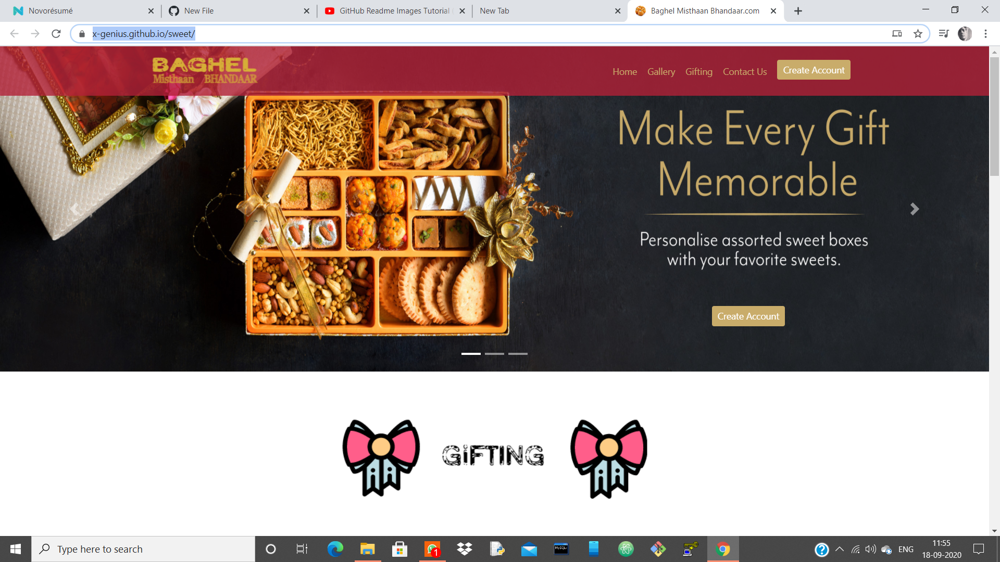
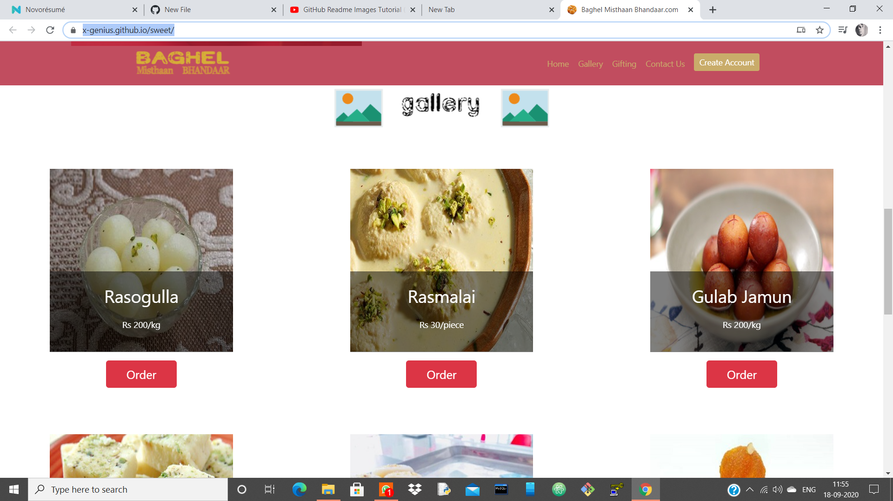
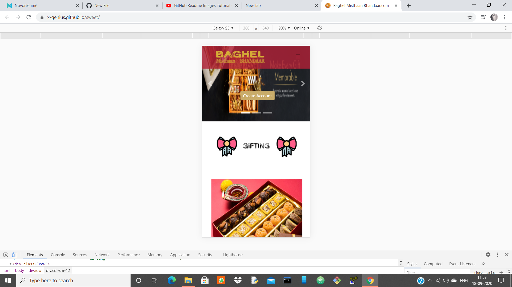
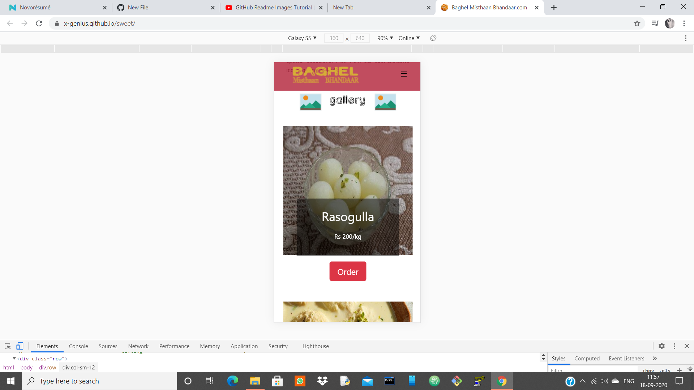
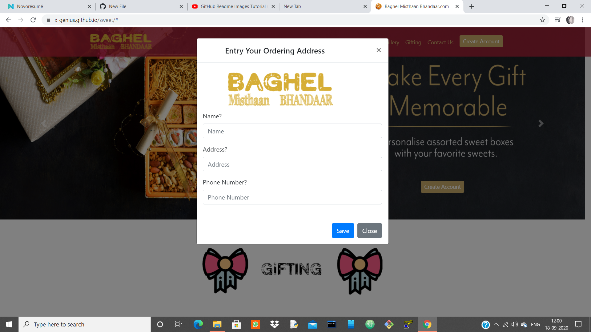
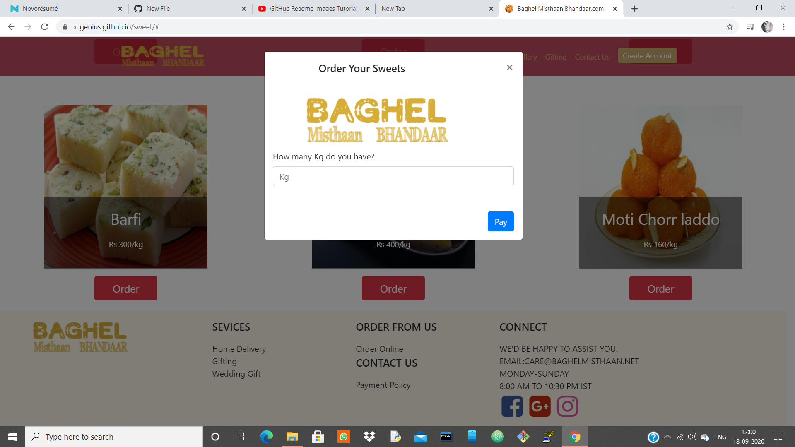

# sweet-shop.
Based on HTML, CSS, Bootstrap.
It is a simple project based on my sweet shop. I'm only providing the design of a decent sweet shop website’s look in it.It is attractive and quite simple.

# Screen-Shots
# 1.First Desktop view :

# 2.Add Responsive view ScreenShots :

# 3.Add forms ss :

